# Phoenix RSS: 基于 Go 微服务的 AI 驱动型 RSS 聚合平台

[](https://github.com/username/repo/actions)
[](https://goreportcard.com/report/github.com/username/repo)
[](https://codecov.io/gh/username/repo)
[](./LICENSE)

面对海量信息源，传统 RSS 阅读器在信噪比、可扩展性和智能化方面存在瓶颈。Phoenix RSS 是一个为应对该挑战而设计的分布式内容聚合系统。它采用 Go 构建的微服务架构，将订阅源处理、AI 内容分析与用户 API 等核心关注点解耦，实现了服务间的独立伸缩与高可用性。系统的核心是基于 Kafka 的事件驱动架构，确保了异步化、高弹性的数据处理链路。它集成了 AI 模型进行内容摘要与分析，将原始信息流智能地转化为结构化、高价值的洞察。整个平台通过 Docker 实现完全容器化部署，展现了生产级的工程实践。

---

## 核心特性

-   **微服务架构**：一套独立的、单一职责的服务组件（API Gateway、User、Feed、AI、Scheduler），通过 gRPC 进行高性能通信。
-   **集成 Web UI**：快速、现代的 SvelteKit 前端直接嵌入 API Gateway，在单个易于部署的二进制文件中提供完整的应用体验。
-   **AI 驱动的内容处理**：通过 Kafka 事件利用大语言模型自动处理和总结文章内容，增强内容可发现性。
-   **后台文章刷新**：调度器驱动的文章检查使用条件 HTTP 请求（ETag / Last-Modified）仅在源内容变化时刷新，遵守 robots.txt 并将工作发布到 Kafka 以实现弹性处理。
-   **事件驱动核心**：使用 Kafka 实现服务间异步、解耦的通信，确保弹性和可扩展性。
-   **容器化与生产就绪**：通过 Docker 完全容器化，使用 Docker Compose 编排，具备健康检查和流畅的多阶段构建流程。

## 技术栈

| 类别                   | 技术                                      |
| ---------------------- | ---------------------------------------- |
| 编程语言               | Go                                       |
| API 网关与 Web 服务    | Gin                                      |
| 前端                   | SvelteKit（通过 `adapter-static`）        |
| 服务间通信             | gRPC + Protocol Buffers                  |
| 数据库                 | PostgreSQL                               |
| 事件总线 / 消息队列    | Kafka                                    |
| 容器化                 | Docker & Docker Compose                  |

```mermaid
graph TB
    subgraph "Client Layer"
        WEB[Web Browser]
    end

    subgraph "API Gateway"
        API[api-service<br/>Gin HTTP + Embedded SvelteKit]
    end

    subgraph "Core Services"
        USER[user-service<br/>gRPC]
        FEED[feed-service<br/>gRPC + Kafka Consumer]
    end

    subgraph "Background Services"
        SCHED[scheduler-service<br/>Cron + Kafka Producer]
        AI[ai-service<br/>Kafka Consumer]
    end

    subgraph "Data Layer"
        PG[(PostgreSQL<br/>Primary Store)]
        REDIS[(Redis<br/>Token Cache)]
    end

    subgraph "Event Bus"
        KAFKA[Kafka<br/>Topics: feed-fetch, article-check, articles-new, articles-processed]
    end

    WEB -->|HTTP/REST| API
    API -.->|gRPC| USER
    API -.->|gRPC| FEED
    API -.->|Cache Read/Write| REDIS
    
    SCHED -->|Produce: feed-fetch| KAFKA
    SCHED -->|Produce: article-check| KAFKA
    FEED -->|Consume: feed-fetch| KAFKA
    FEED -->|Consume: article-check| KAFKA
    FEED -->|Produce: articles-new| KAFKA
    AI -->|Consume: articles-new| KAFKA
    AI -->|Produce: articles-processed| KAFKA
    FEED -->|Consume: articles-processed| KAFKA
    
    USER --> PG
    FEED --> PG
    
    SCHED -.->|gRPC List Feeds| FEED

    style API fill:#4A90E2
    style KAFKA fill:#231F20
    style PG fill:#336791
    style REDIS fill:#DC382D
```



## 项目结构

```
.
├── web/                  # SvelteKit 前端应用
├── cmd/                  # 各服务的应用程序入口点
├── internal/             # 私有应用程序和库代码
├── docs/                 # 项目设计和架构文档
├── protos/               # Protocol Buffer 定义
├── db/                   # 数据库迁移
└── docker-compose.yml    # Docker Compose 配置
```

## 使用方法

Phoenix RSS 设计为完全通过 Docker Compose 运行。

### 前置要求

-   Docker
-   Docker Compose (v2+)

### 1. 初始设置与迁移

首先，从模板创建您的 `.env` 文件。这只需要做一次。

```bash
cp env.example .env
# 记得编辑 .env 文件，填入您的敏感值（例如 API 密钥）
```

接下来，运行数据库迁移：

```bash
docker compose run --rm migrator up
```

### 2. 启动所有服务

首次启动或在重大更改后，构建并启动整个应用程序栈：

```bash
docker compose up --build -d
```

Web 应用程序将在 `http://localhost:8080` 可访问。

### 2.1 认证令牌缓存

API Gateway 保留一个短期（5 分钟）的 Redis 缓存来存储已验证的用户令牌，以减少与 user-service 的 gRPC 通信。默认情况下，它连接到您配置/Docker Compose 网络中的 `REDIS_ADDRESS`。如果 Redis 不可达，网关会回退到直接验证——无需手动操作，但在 Redis 恢复之前会有更高的延迟。

### 3. 停止应用程序

```bash
docker compose down
```

