# Phoenix RSS

[English](./README.md)

一个现代化的、AI 驱动的 RSS 聚合器，采用 Go 微服务构建。本项目展示了事件驱动系统与 LLM 集成的模式，具备通过 Kafka 实现的异步处理和无缝集成的 Web UI，是一个个人项目和参考实现。

RSS 订阅源通常包含大量内容。Phoenix RSS 使用 AI 自动总结文章并提取元数据，帮助你专注于真正重要的内容。

## 特性

-   **微服务架构**：独立的、单一职责的服务（API Gateway、User、Feed、AI、Scheduler）通过 gRPC 通信。
-   **事件驱动管道**：基于 Kafka 的异步处理，调度器驱动的 Feed 刷新，条件 HTTP 请求（ETag/Last-Modified），遵守 robots.txt。
-   **AI 驱动的摘要**：通过 Kafka 事件触发，利用 LLM 自动生成文章摘要和元数据提取。
-   **集成 Web UI**：SvelteKit 前端直接嵌入 API Gateway。
-   **容器化部署**：Docker Compose 编排，具备健康检查和自动初始化。

## 架构

API Gateway 暴露 HTTP 端点并嵌入 SvelteKit 前端。内部服务通过 gRPC 通信。异步工作流（Feed 刷新、AI 处理）通过 Kafka 流转，调度器发布任务，工作者消费任务。PostgreSQL 负责持久化，Redis 提供缓存。

```mermaid
graph TB
    subgraph "Client Layer"
        WEB[Web Browser]
    end

    subgraph "API Gateway"
        API[api-service<br/>Gin HTTP + Embedded SvelteKit]
    end

    subgraph "Core Services"
        USER[user-service<br/>gRPC]
        FEED[feed-service<br/>gRPC + Kafka Consumer]
    end

    subgraph "Background Services"
        SCHED[scheduler-service<br/>Cron + Kafka Producer]
        AI[ai-service<br/>Kafka Consumer]
    end

    subgraph "Data Layer"
        PG[(PostgreSQL)]
        REDIS[(Redis<br/>Feeds Cache)]
    end

    subgraph "Event Bus"
        KAFKA[Kafka]
    end

    WEB -->|HTTP/REST| API
    API -.->|gRPC| USER
    API -.->|gRPC| FEED
    API --> REDIS
    API --> PG
    
    SCHED --> KAFKA
    KAFKA <--> FEED
    KAFKA <--> AI
    
    USER --> PG
    FEED --> PG
    
    SCHED -.->|gRPC| FEED

    style API fill:#4A90E2
    style KAFKA fill:#231F20
    style PG fill:#336791
    style REDIS fill:#DC382D
```



## 服务

| 服务              | 职责                                       |
|-------------------|-------------------------------------------|
| api-service       | HTTP API 网关、认证、嵌入并服务前端         |
| user-service      | 用户注册、登录、JWT 签发/验证              |
| feed-service      | Feed 管理、RSS 抓取、文章存储              |
| scheduler-service | 基于 Cron 的任务，发布 Feed/文章事件       |
| ai-service        | 消费新文章并生成 AI 摘要                   |


## 技术栈

| 类别              | 技术                             |
| ----------------- | -------------------------------- |
| 编程语言          | Go                               |
| API Gateway       | Gin                              |
| 前端              | SvelteKit (`adapter-static`)     |
| 服务间通信        | gRPC + Protocol Buffers          |
| 数据库            | PostgreSQL                       |
| 缓存              | Redis                            |
| 事件总线          | Kafka                            |
| 容器化            | Docker & Docker Compose          |

## 使用方法

Phoenix RSS 设计为完全通过 Docker Compose 运行。一条命令即可完成所有工作：基础设施启动、数据库迁移、Kafka Topic 创建和服务编排。

### 前置要求

-   Docker
-   Docker Compose (v2+)

### 快速开始

1. 从模板创建 `.env` 文件：

```bash
cp env.example .env
# 编辑 .env 文件，填入你的配置值（如 AI_SERVICE_LLM_API_KEY）
```

2. 启动应用：

```bash
docker compose up -d
```

系统会自动：
- 启动 PostgreSQL、Redis 和 Kafka 并进行健康检查
- 创建所需的 Kafka Topic
- 运行数据库迁移
- 按正确顺序启动所有应用服务

可通过浏览器访问 `http://localhost:8080`。

### 停止应用

```bash
docker compose down
```

### 代码修改后重新构建

```bash
# 重新构建特定服务
docker compose build feed-service
docker compose up -d feed-service

# 重新构建所有服务
docker compose up --build -d
```

### 管理 CLI

提供了 `phoenix-admin` CLI 工具，用于管理文章、查看统计信息和触发 AI 处理。

## 局限

-   AI 功能依赖外部 LLM 提供商（需要 API 密钥，费用由提供商计费）
-   认证功能基础（仅 JWT，无 RBAC 或多租户）
-   可观测性限于结构化日志（无分布式追踪或指标）
-   未针对高流量场景进行负载测试
-   单集群部署设计（无多区域策略）

## 路线图

- [ ] OpenTelemetry 集成（分布式追踪 + 指标）
- [ ] Kubernetes 部署清单（Helm / Kustomize）
- [ ] 通过 PostgreSQL 实现全文搜索
- [ ] 增强多用户支持（注册流程、基础 RBAC）
