# Phoenix RSS

[中文文档](./README-zh.md)

A modern, AI-powered RSS aggregator built with Go microservices. This project demonstrates patterns for event-driven systems with LLM integration, featuring asynchronous processing via Kafka and a seamlessly integrated web UI, and is intended as a personal side project and reference implementation.

RSS feeds often contain overwhelming amounts of content. Phoenix RSS uses AI to automatically summarize and extract metadata from articles, helping you focus on what matters.

## Features

-   **Microservice Architecture**: Independent, single-responsibility services (API Gateway, User, Feed, AI, Scheduler) communicating over gRPC.
-   **Event-Driven Pipeline**: Kafka-based asynchronous processing with scheduler-driven feed refresh, conditional HTTP requests (ETag/Last-Modified), and robots.txt compliance.
-   **AI-Powered Summarization**: Automatic article summarization and metadata extraction via LLM, triggered through Kafka events.
-   **Integrated Web UI**: SvelteKit frontend embedded directly into the API Gateway.
-   **Containerized Deployment**: Docker Compose orchestration with healthchecks and automated initialization.

## Architecture

The API Gateway exposes HTTP endpoints and embeds the SvelteKit frontend. Internal services communicate via gRPC. Asynchronous workflows (feed refresh, AI processing) flow through Kafka, with the scheduler publishing tasks and workers consuming them. PostgreSQL handles persistence while Redis provides caching.

```mermaid
graph TB
    subgraph "Client Layer"
        WEB[Web Browser]
    end

    subgraph "API Gateway"
        API[api-service<br/>Gin HTTP + Embedded SvelteKit]
    end

    subgraph "Core Services"
        USER[user-service<br/>gRPC]
        FEED[feed-service<br/>gRPC + Kafka Consumer]
    end

    subgraph "Background Services"
        SCHED[scheduler-service<br/>Cron + Kafka Producer]
        AI[ai-service<br/>Kafka Consumer]
    end

    subgraph "Data Layer"
        PG[(PostgreSQL)]
        REDIS[(Redis<br/>Feeds Cache)]
    end

    subgraph "Event Bus"
        KAFKA[Kafka]
    end

    WEB -->|HTTP/REST| API
    API -.->|gRPC| USER
    API -.->|gRPC| FEED
    API --> REDIS
    API --> PG
    
    SCHED --> KAFKA
    KAFKA <--> FEED
    KAFKA <--> AI
    
    USER --> PG
    FEED --> PG
    
    SCHED -.->|gRPC| FEED

    style API fill:#4A90E2
    style KAFKA fill:#231F20
    style PG fill:#336791
    style REDIS fill:#DC382D
```



## Services

| Service           | Responsibility                                      |
|-------------------|-----------------------------------------------------|
| api-service       | HTTP API gateway, auth, embeds and serves frontend |
| user-service      | User registration, login, JWT issuing/validation   |
| feed-service      | Feed management, RSS fetching, article storage     |
| scheduler-service | Cron-based jobs that publish feed/article events   |
| ai-service        | Consumes new articles and produces AI summaries    |


## Tech Stack

| Category              | Technology                       |
| --------------------- | -------------------------------- |
| Language              | Go                               |
| API Gateway           | Gin                              |
| Frontend              | SvelteKit (`adapter-static`)     |
| Service Communication | gRPC + Protocol Buffers          |
| Database              | PostgreSQL                       |
| Caching               | Redis                            |
| Event Bus             | Kafka                            |
| Containerization      | Docker & Docker Compose          |

## Usage

Phoenix RSS is designed to be run entirely with Docker Compose. A single command handles everything: infrastructure startup, database migrations, Kafka topic creation, and service orchestration.

### Prerequisites

-   Docker
-   Docker Compose (v2+)

### Quick Start

1. Create your `.env` file from the template:

```bash
cp env.example .env
# Edit .env with your values (e.g., AI_SERVICE_LLM_API_KEY)
```

2. Start the application:

```bash
docker compose up -d
```

That's it! The system will automatically:
- Start PostgreSQL, Redis, and Kafka with health checks
- Create required Kafka topics
- Run database migrations
- Start all application services in the correct order

The web application will be available at `http://localhost:8080`.

### Stopping the Application

```bash
docker compose down
```

### Rebuilding After Code Changes

```bash
# Rebuild specific service
docker compose build feed-service
docker compose up -d feed-service

# Rebuild all services
docker compose up --build -d
```

### Admin CLI

A `phoenix-admin` CLI tool is bundled for managing articles, viewing statistics, and triggering AI processing.

## Limitations

-   AI features depend on an external LLM provider (API key required, usage billed by the provider).
-   Auth is basic (JWT only, no RBAC or multi-tenancy)
-   Observability limited to structured logging (no distributed tracing or metrics)
-   Not load-tested for high-traffic scenarios
-   Single-cluster deployment design (no multi-region strategy)

## Roadmap

- [ ] OpenTelemetry integration (distributed tracing + metrics)
- [ ] Kubernetes deployment manifests (Helm / Kustomize)
- [ ] Full-text search via PostgreSQL
- [ ] Enhanced multi-user support (registration flow, basic RBAC)
